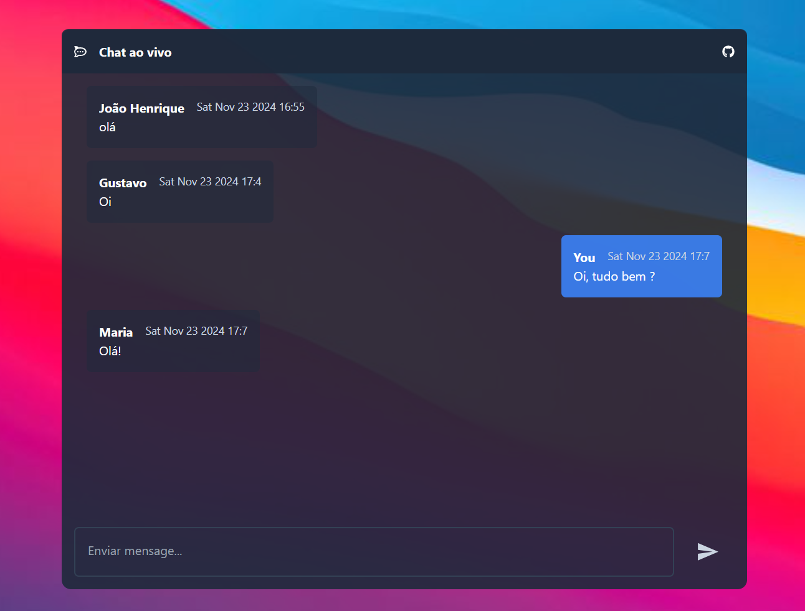

<h1 align="center"> 🌐 Live chat Client </h1>
 

##### :point_right: [Projeto ao vivo ](https://jhenriquem.github.io/live-chat-client/) 
##### :point_right: [Server side](https://github.com/jhenriquem/live-chat-server)

Front-end de um chat ao vivo, criado com react, tailwindcss e vite.js. 

### Instalação e execução 

-   Clone o repositório e acesseo 
```bash
git clone https://github.com/jhenriquem/live-chat-client/
cd live-chat-client
```
-  Instale todas as dependências
```bash
npm install 
```

-  Execute o servidor
```bash
npm run dev 
```
